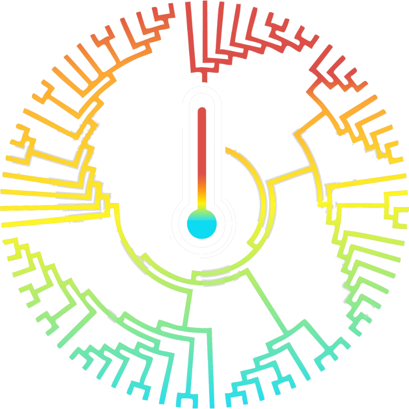

# The PEACE Lab

**Plasticity and Ecological Adaptations to Changing Environments**

Department of Biological and Environmental Sciences 
University of Gothenburg, Sweden

[**patricepottierlab.com**](https://patricepottierlab.com)

---

We study how biodiversity responds to rapidly changing environments. Our aim is
to understand how animals cope with environmental change, from the mechanistic
to the global scale, so we can better predict and mitigate the impacts of
climate change on our precious biodiversity.

The lab is led by [Patrice Pottier](https://patricepottierlab.com/people/), and
works across laboratory experiments, evidence synthesis and comparative
analyses, on amphibians, fish, reptiles and invertebrates.

## What we work on

Our research runs along ten themes, grouped into three strands.

**How animals cope with heat**

- Thermal sensitivity across the life cycle
- Plasticity and adaptation to changing temperatures
- The impacts of temperature on reproduction
- Developmental responses to environmental stressors

**From the laboratory to the world**

- Translating laboratory measurements to the field
- Understanding species (re)distribution
- Bridging the knowledge-action gap

**Better evidence**

- Solving biases in the ecological literature
- Improving methods for evidence synthesis
- Studying how research is done through meta-science

Each theme is written up with its open questions on the
[research page](https://patricepottierlab.com/research/).

## Join us

Two funded positions are open at the University of Gothenburg, both closing on
**21 September 2026**: a four-year PhD position and a two-year postdoctoral
position, funded by the Swedish Research Council. There are also fellowship
routes for researchers bringing their own funding, and short-term visits.

We care more about how you think than about what you have published. Details
and the application links are on the
[opportunities page](https://patricepottierlab.com/opportunities/).

## About this repository

This repository holds the source of the lab website. It is a React and Vite
application, styled with Tailwind, deployed to GitHub Pages on every push to
`main`. Publications, citation counts and the collaborator map are rebuilt
nightly from ORCID, Crossref and OpenAlex, so the site stays current without
anyone editing it.

You are welcome to read the code or borrow from it. If something here is useful
for your own academic site, take it.

## Elsewhere

[Website](https://patricepottierlab.com) ·
[Google Scholar](https://scholar.google.com/citations?user=gg1rV3IAAAAJ&hl=en) ·
[ORCID](https://orcid.org/0000-0003-2106-6597) ·
[Bluesky](https://bsky.app/profile/patricepottier.bsky.social) ·
[Thermal Ecology Alliance](https://www.thermalecologyalliance.org/)

Get in touch at [patrice.pottier@bioenv.gu.se](mailto:patrice.pottier@bioenv.gu.se).
